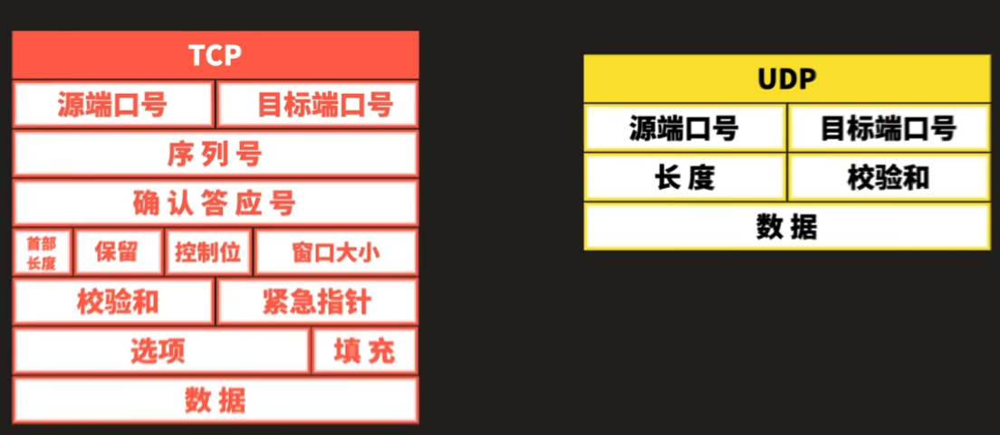

# UDP & TCP

* UDP：使用UDP协议时，不需要建立连接，只需要知道对方的IP地址和端口号，就可以直接发数据包。但是，能不能到达就不知道了。

* TCP：TCP是建立可靠连接，并且通信双方都可以以流的形式发送数据。

***

* 比如你在上厕所，忽然发现没纸了
  * UDP：喊旁边的陌生人给纸，但是纸可能飞不到你这里，那么你就要让对方再给一次，甚至这样的过程重复数次（数据不稳定性，比如题中要求多次互动，有没有可能是考虑到UDP一次发送大量数据会造成乱码？没有序列号和确认答应号）
  * TCP：打电话让你朋友送纸（会进行三次握手，好比说你问朋友有时间没，他说有，你说来吧，然后就形成了一对一的链接）
  * 即使UDP要让对面扔三四次纸，一般还是会比TCP更快一点。

****

* UDP应用方面：比如说部分游戏，视频，语音等。有些丢包不影响大局，就还可以继续，而TCP却会等丢包数据再发送再继续进行，造成时间差的存在。
